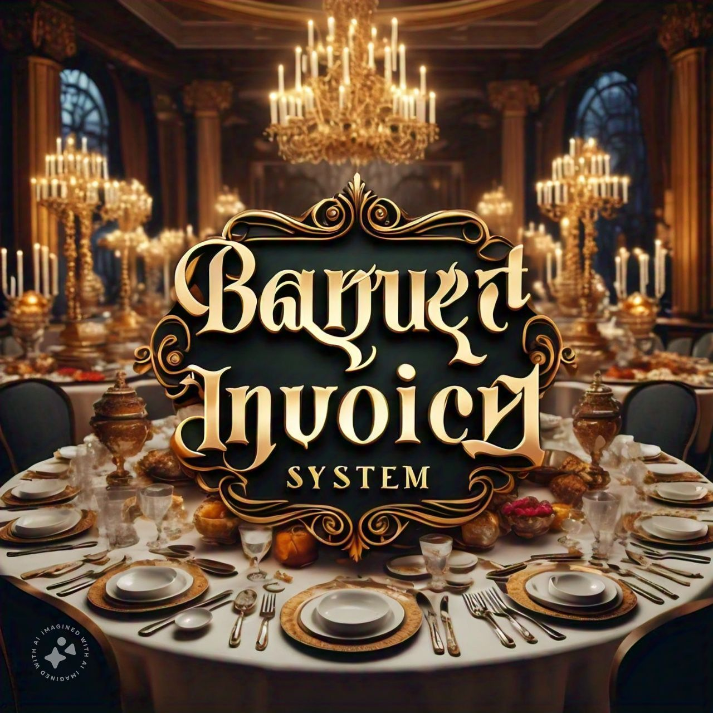

<p align="center">
  <a href="" rel="noopener">
 </a>
</p>

<h3 align="center">Banquet Invoice System</h3>

<div align="center">

[]()
[](https://github.com/kylelobo/The-Documentation-Compendium/issues)
[](https://github.com/kylelobo/The-Documentation-Compendium/pulls)
[](/LICENSE)

</div>

---

<p align="center"> This Banquet invoice system, a containerized web-app is built using fastify for server, sequelize and postgreSQL for backend.
    <br> 
</p>

## 📝 Table of Contents

- [About](#about)
- [Getting Started](#getting_started)
- [Usage](#usage)
- [Built Using](#built_using)
- [Authors](#authors)

## 🧐 About <a name = "about"></a>

A Banquet invoice system in which admin adds, edits or deletes Meals & Manager quotes the total price generated by the application to customer. This containerized web-app is built using fastify for server, sequelize and postgreSQL for backend.

## 🏁 Getting Started <a name = "getting_started"></a>

These instructions will get you a copy of the project up and running on your local machine for development and testing purposes.

### Prerequisites
Make sure you have installed [NodeJs](https://nodejs.org/en/).


### Installing

A step by step series of examples that tell you how to get a development env running.

clone the project using:

```
git clone https://github.com/rayyansajid/Banquet-invoice-backend.git
```

install modules using:

```
npm install
```
run the following command in terminal:
```
docker-compose up -d
```
finally, run:
```
npm start
```


## 🎈 Usage <a name="usage"></a>

Admin - Add/Update/Delete a Meal.
Manager - Enters Client's preffered Meals and gets a printable slip.

## ⛏️ Built Using <a name = "built_using"></a>

- [PostgreSQL](https://www.postgresql.org/) - Database
- [Fastify](https://fastify.dev/) - Server Framework
- [NodeJs](https://nodejs.org/en/) - Server Environment

## ✍️ Authors <a name = "authors"></a>

- [@rayyansajid](https://github.com/rayyansajid) - Idea & Initial work

